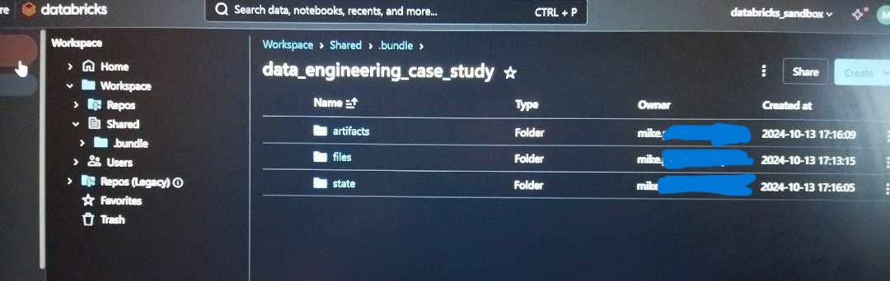
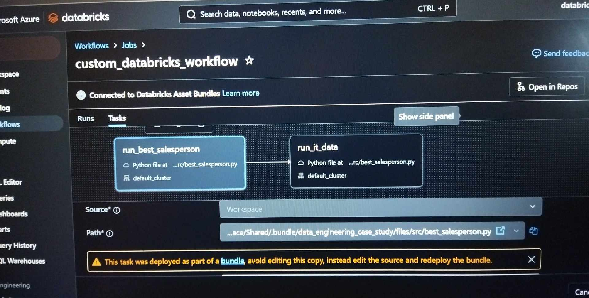

# Data Engineering Case Study

## Description

The current repository serves as the produced output of the tasks demonstrated in the exercise.md file. Each script within the src/ folder is linked to a directory within the output/ folder with the same name.

## Setup

To run this version the following requirements must be met on a local PC.

- Install Python 3.10
- Install pyspark 3.5.0
- Install packages within requirements.txt
- Additionally setup Hadoop v3.3.5 within a Windows operating system, by accordingly specifying the HADOOP_HOME environment variable.

## Project Outline

```bash
├───.github 
│   └───workflows : CI/CD build pipelines.
├───archive : Archived documents.
│   └───python : Archived / Non production ready python code.
├───data : Source csv files containing necessary provided data.
├───output : Hosts directories that include csv files, containing extracted data per task.
│   ├───best_salesperson
│   ├───department_breakdown
│   ├───it_data
│   ├───marketing_address_info
│   ├───top_3
│   └───top_3_most_sold_per_department_netherlands
├───resources : Databricks workflows specified in yml format. 
├───src : Source code, namely python scripts that produce extracted data, saved in the outputs/ folder. 
│   ├───sales_data : Packaged application. 
├───utility: Test functions and logging configuration files.
├───img: Files used in the readme.
databricks.yml : Databricks Asset Bundle configuration file. Used in the CI/CD deployment process.
setup.py: File specifying the build process.
pyproject.toml: File specifying the tools needed to setup application sales-data.
```

## ETL description

Each ETL script has the same outline. Within main(), the produce_data function is used to extract the wanted features and, if all checks are successful, write the data to the designated output/ folder. <br>
A logger is also used to monitor the script behaviour.

## CI/CD with Databricks Asset Bundles

### Description
A test pipeline is initiated whenever a pull request is opened on the main branch. If the pull request is merged into main, a deployment pipeline is also initiated. <br>
For the CI/CD process an Azure service principal is used to authenticate with the Github Actions agent, by using the appropriate environment variables. <br>
A personal Databricks workspace was used as a destination for the artifacts specified within the databricks.yml file. The appropriate environment variables ```DATABRICKS_HOST``` and ```DATABRICKS_TOKEN```
are used for authentication between the agent and the databricks workspace, by using the Databricks CLI. <br>

### Proof of deployment

The following workflow and artifacts are deployed as part of the deployment pipeline.

Assets
<br>

Workflow
<br>


## Entry point - Setup
Within the folder src/sales_data all the following functions are be packaged as a standalone application. <br>
The end user can use the distribution produced by the setup.py and run commands on the terminal to produce the wanted output. <br>


